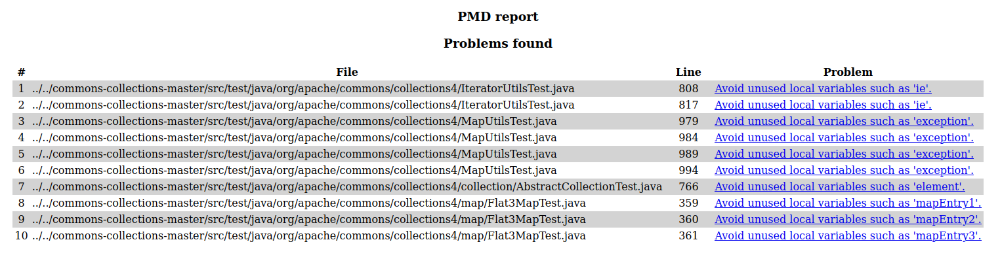

# Using PMD

Pick a Java project from Github (see the [instructions](../sujet.md) for suggestions). Run PMD on its source code using any ruleset. Describe below an issue found by PMD that you think should be solved (true positive) and include below the changes you would add to the source code. Describe below an issue found by PMD that is not worth solving (false negative). Explain why you would not solve this issue.

## Answer

I generated thanks to pmd using this command 
```./run.sh pmd -d ../../commons-collections-master -f html -R java-unusedcode > ../../pmd-q2.html```
the following html document :


I would not solve most of thoose issue, problem here being mostly the unuse of Exception handling variable, the source code is actually using it's own error message / not handling the error at all because it is only present in the tests cases.
